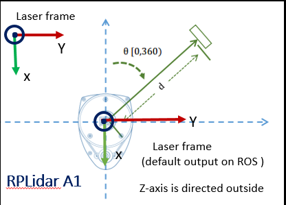

RPLIDAR ROS package
=====================================================================

ROS 2 node and test application for RPLIDAR

Visit following Website for more details about RPLIDAR:

rplidar roswiki: http://wiki.ros.org/rplidar

rplidar HomePage:   http://www.slamtec.com/en/Lidar

rplidar SDK: https://github.com/Slamtec/rplidar_sdk

rplidar Tutorial:  https://github.com/robopeak/rplidar_ros/wiki

How to build rplidar ros package
=====================================================================
    1) Clone this project to your colcon's workspace src folder
    2) Running `colcon build` to build `rplidar_node`

How to run rplidar ros package
=====================================================================

```
$ ros2 run rplidar_ros rplidar_node  # for RPLIDAR A1/A2
$ ros2 run tf2_ros static_transform_publisher 0 0 0 0 0 0  world laser_frame  # this is to transform fixed frame to laser .
```

Run rviz2
```
$ rviz2    # change Fixed Frame option from fixed_frame to laser_frame and add LaserScan

```


RPLidar frame
=====================================================================
RPLidar frame must be broadcasted according to pictures shown below




